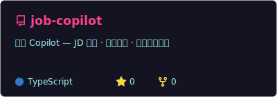

  

  
  
  

 

  <samp>
    <b>zhengjs</b> · AI运营自动化 · 全栈开发 
    让内容运营真正智能化
  </samp>

 

  
  
  
  
  
  

 

---

 

### 📦 Pinned

  
  
   
  
  

 

---

 

### 📊 Stats

  
  

  

 

---

  ✨ 持续构建中 · Thanks for stopping by
   
  

